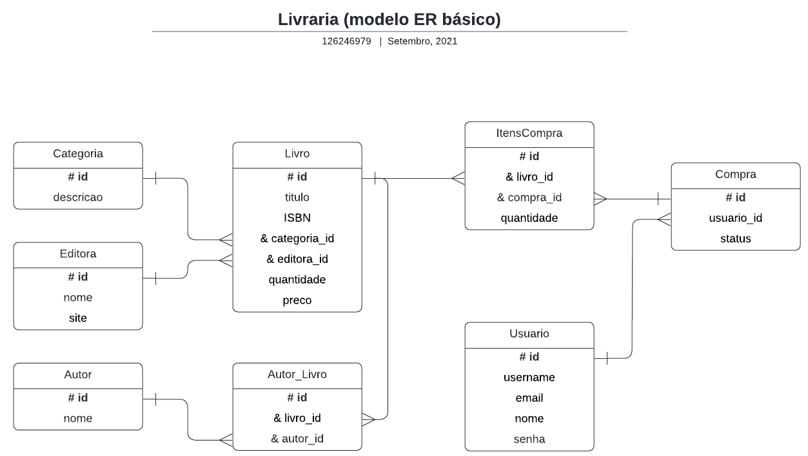
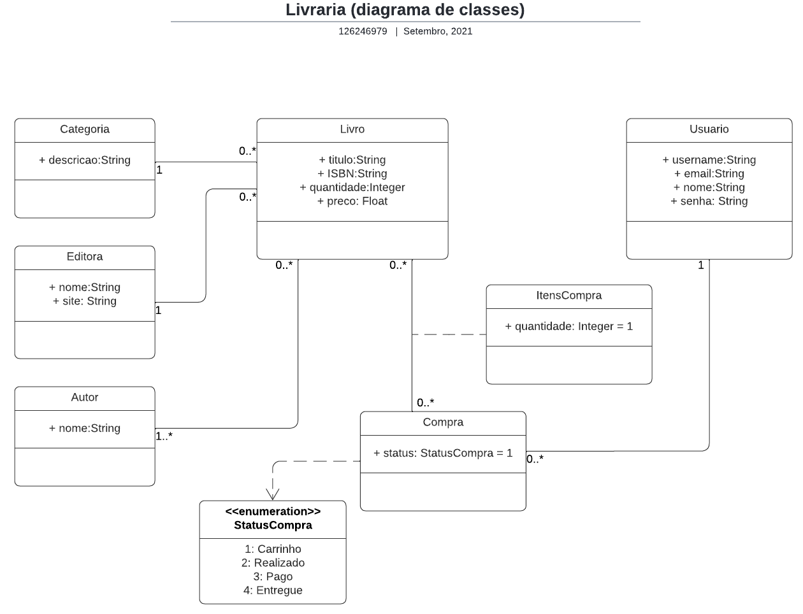

# Projeto Livraria
**Descrição**
O projeto final consiste em desenvolver um projeto de uma livraria conforme os modelo de ER e Diagrama de Classes abaixo. A ideia é desenvolver uma aplicação completa utilizando Banco de Dados, Programação Orientada a Objetos e interface html utilizando DOM.

**Modelo Entidade Relacionamento**

**Diagrama de Classes**

## Passos para o desenvolvimento do projeto

**Passo 1**
Se ainda não tiver, crie uma conta no GitHub, após isso crie um repositório para o projeto com o nome: ``Projeto Final POO''

**Passo 2** 
Implementar os scripts necessários para a criação do BD, utilizando a biblioteca o pacote ``sql-wasm'', conforme o Diagrama Entidade Relacionamento.

**Passo 3**
Implementar as classes necessárias para o desenvolvimento do projeto, conforme o Diagrama de Classes.

**Passos 4**
Implementar as rotinas para fazer inserção, exclusão e consultas no BD

**Passo 4**
Desenvolver interfaces básicas em html utilizando DOM para acesso às classes

**Passo 5**
Associar as interfaces com os scripts JS e testar as funcionalidades de inserção, exclusão e consultas

